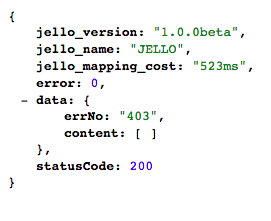

# Jello express服务端api映射框架

## 要解决的问题 

前后端分离的开发方案中，前端的数据层被剥离出来而独立存在，通常数据层由服务端的api来提供，这就导致我们需要在Express的路由层
反复的配置；一方面会导致重复劳动,写作繁杂，另一方面对不熟悉nodejs的前端开发同学是一个比较大负担。

## 用法

```bash
// 导入Jello对象, 需要传入express的app实例，路由层router的实例
var Jello = require('./jello')(app, router);
	
// 初始化一个服务器接口的通用配置，比如域名和协议等。
var proxy = Jello.host('www.baidu.com').protocol('https');

// 由通用配置实例化一个具体的服务器接口，并指定路径 
var proxyIndexApi = proxy.api('/home/msg/data/personalcontent');
// 实例化一个本地路由配置并映射到服务器的接口实例上
Jello.pathname('/index').api().map(proxyIndexApi);

// 无api映射，仅仅是展示一个模板
Jello.page('/thanks').map();

```

## 更多设置

### 服务端api接口动态替换
例如服务器端接口是经过优化过的对搜索引擎友好的形式，比如请求一个用户的id信息的接口，它的path部分如下

```bash
http://apihost/user/{id}
```

其中id的部分是动态指定的，为了将此种类型的接口作为我们的api层接口，需要动态的生成具体的请求api，这就需要动态的根据query来生成。
这是我们可以指定服务端的api的path部分为

```bash
// 由通用配置实例化一个具体的服务器接口，并指定路径 
var proxyIndexApi = proxy.api('/user/%id');
// 实例化一个本地路由配置并映射到服务器的接口实例上
Jello.pathname('/user').api().map(proxyIndexApi);
```

那么在请求user页面，只要请求的url带上id参数即可动态请求到api层。
```bash
http://host/user/?id=1
```

其中query的参数名字一定要与path部分百分号后的字符组合匹配

### 打开api cookie回写功能

很多情况下，前后端分离之后仍然在同一个域名之下，逻辑上是一个整体；因此本地页面或者接口所映射的api层会回写业务cookie给浏览器，由于采用的分离式的开发方法，
此时api层的回写必须手动开启才能工作，流程是api层回写给nodejs层，nodejs层回写给用户浏览器。

```bash
var proxyIndexApi = proxy.api('/some/api/of/server').cookie(true);
```

### 设置本地页面模板

对于本地页面，可以为其动态指定模板的名字，此名字可以包含路径和文件名。

	Jello.page('/thanks').render('tpl_name').map();

你也可以省略render调用，jello会自动生成模板名字，策略是讲render调用传入的参数转换为一个模板名，将其中的正反斜线、连接符转换为下划线，去掉头尾的正反斜线。
例如```/a/b/c/```转换为```a_b_c```，查找目录从express声明的模板根目录开始。

### 作为本地页面模板变量,对api层数据层的封装

api层的数据返回，jello会作一层数据整合，如多接口mapping声明。



其中：

* jello_version和jello_name分别是名字和版本声明
* jello_mapping_cost是api层调用时间统计(http请求时间)。
* error 是作为此次请求是否成功的参考，如果http状态码在[200, 300)之间，则被认为是正常error返回0，其他情况非0.
* data 字段下是api层接口原始返回数据。
* statusCode 是api层原始请求状态码。

### HOW TO USE IT
整合```routes```目录下得```jello.js```到你的express项目的```routes```目录下，require导入其即可。例如实例项目的```routes/users.js```
